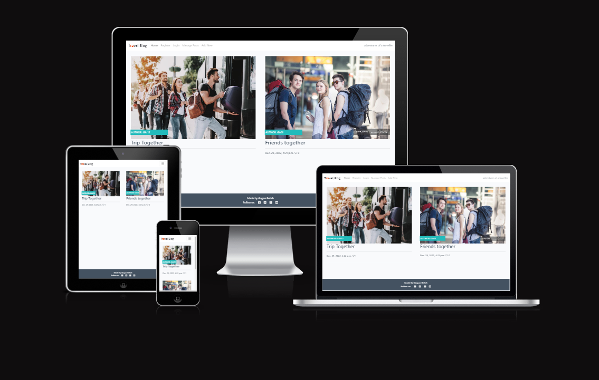
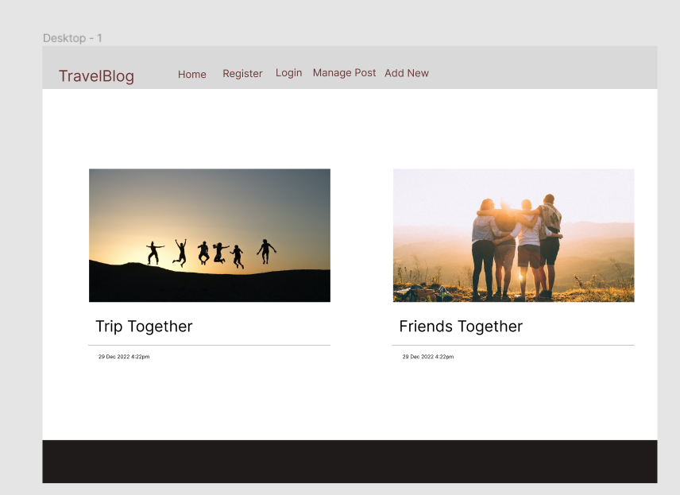
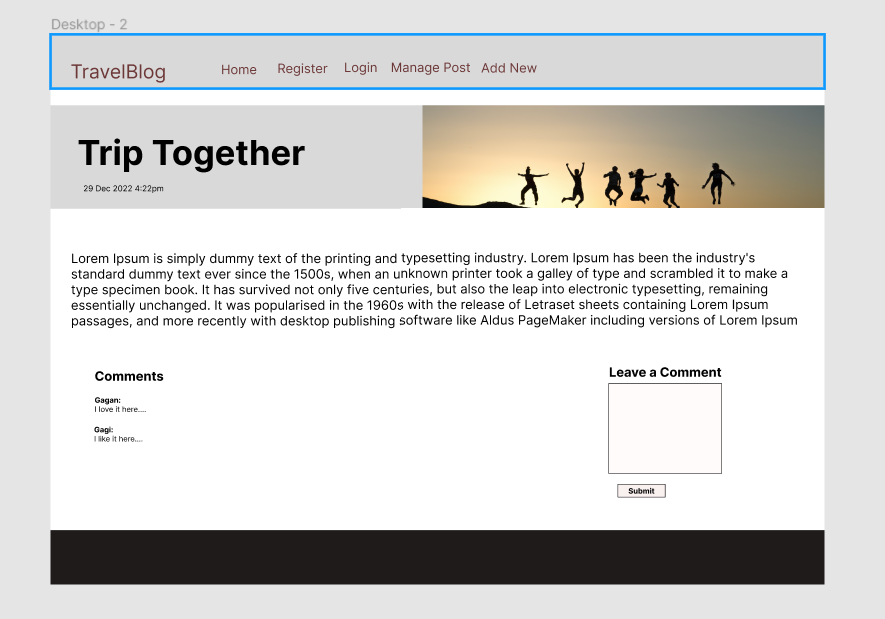
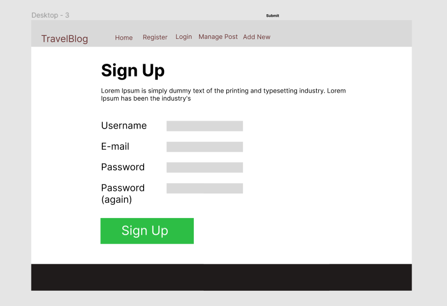
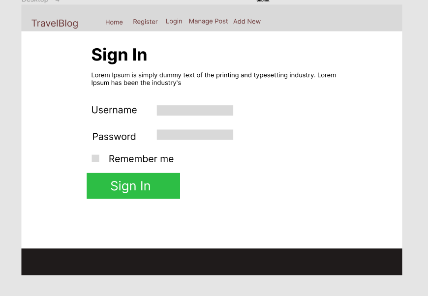
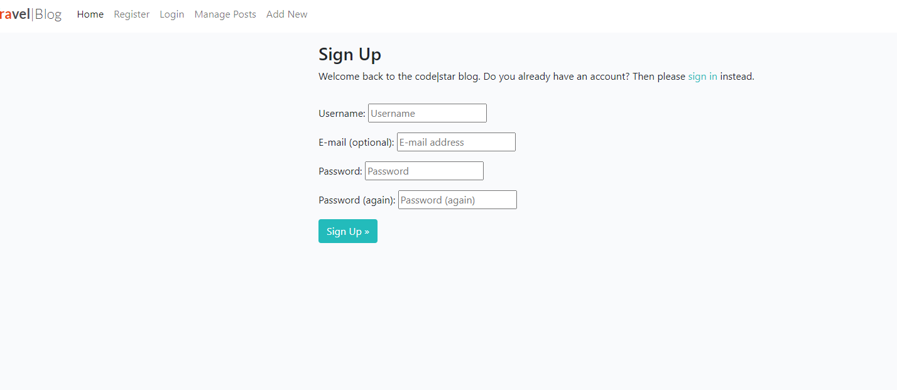
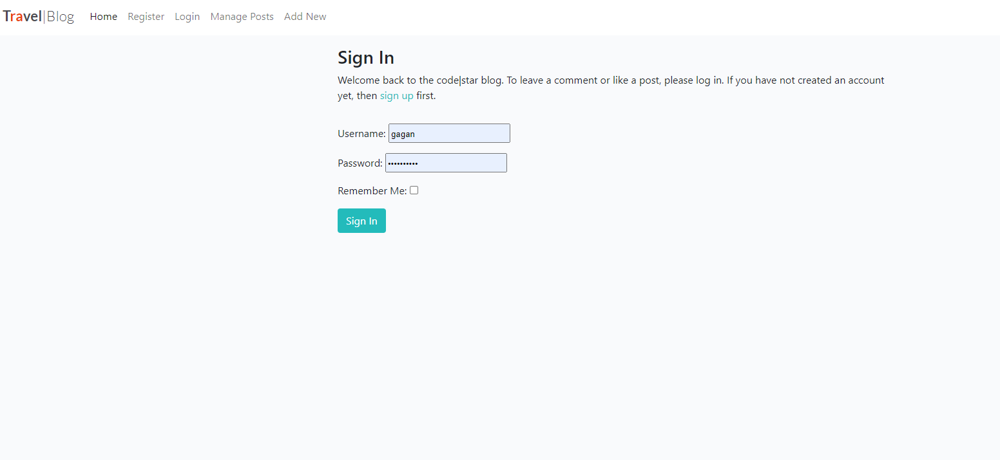
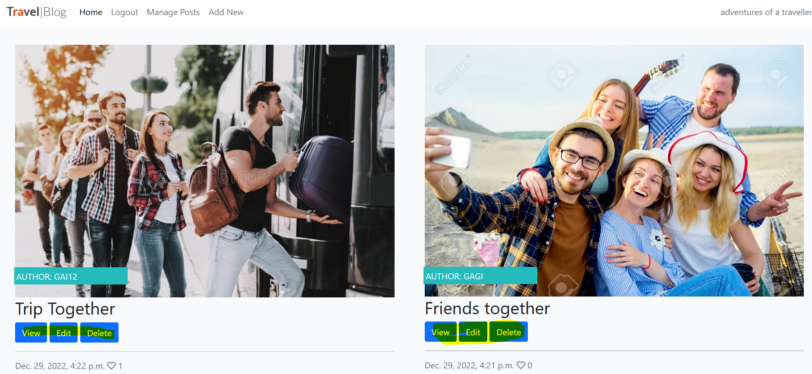
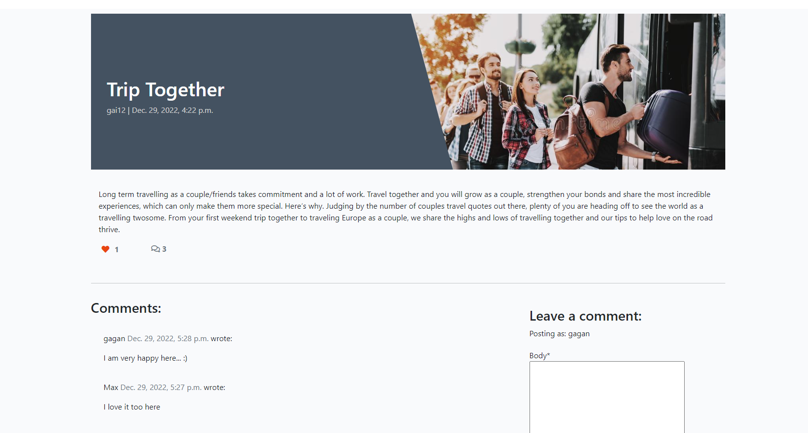
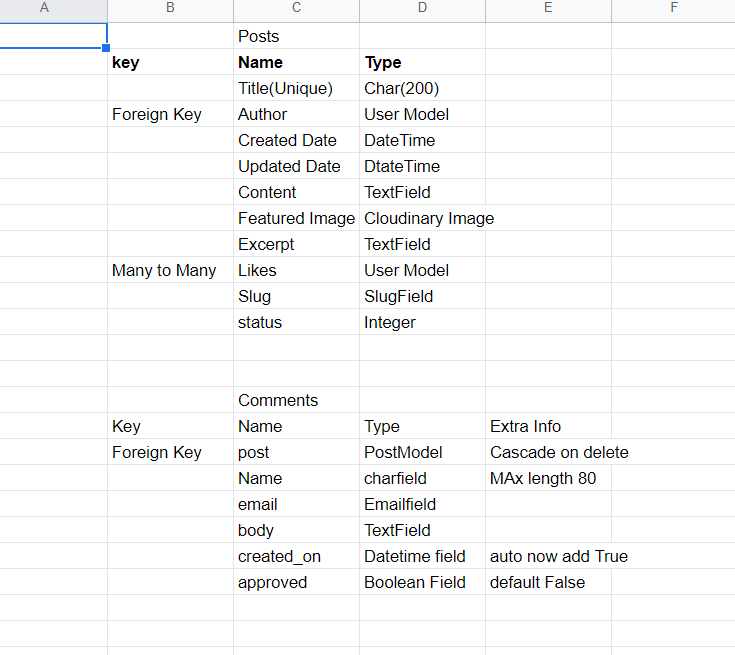

Looking to post your travel blog? You've come to the right place! Travel Blog is a place where you can view how other people have travelled around the world and shared their experiences.You also have the freedom of sharing and commenting on the other people experiences. And,do you have experiences that you'd like to share as well? Great news! You can create your own free account and add an unlimited number of travelling experiences and share it with the world.This website is also responsive

# UX
## User Stories
Navigation: As a user I can view a navbar from every page so that I can navigate easily between pages

Sign up: 
As a user I can create a new account so that I can access all the features for signed up users

Sign in: 
As a user I can sign in to the app so that I can access functionality for logged in users

View most recent posts: 
As a user I can view all the most recent posts

Edit post: 
As a post owner I can edit my post title and description so that I can make corrections or update my post after it was created

Post a comment: 
As a logged in user I can add comments to a post so that I can share my thoughts about the post

View comments: 
As a user I can read comments on posts so that I can read what other users think about the posts

## Wireframe: 
Mockups were designed using Adobe XD

## Existing Features
### Register Account
Anybody can register for free and create their own unique account.

### Log In to Account
Users can easily log out of their account with the click of a button.

### Log Out of Account
Users can easily log out of their account with the click of a button.
### CRUD functionality

### [CRUD]Read functionality
Travelling Posts can be viewed by going on the Manage Posts button on the navigation bar and clicking on View button on the individual post

### Add a post
[CRUD] Create or 'add' a new travelling experience by clicking on the Add New button. 

### Update a Travelling Experience
[CRUD] Update or 'edit' their own travelling experience on this page.

### Delete a Travelling Experience
[CRUD] Delete or 'remove' a  travelling experience by clicking on the Delete button. 

### Detailed view of each post can also be viewed!

## Technologies Used
HTML,
CSS, 
Javascript,
Heroku,
Python,
Django,
ElephantSQL

## Agile Method:
The agile Methodology was used and different user stories were created using Kanban board and implemented for the project.

### Model for project
Here is the model I used

## Validators

#### W3C HTML Validator -
I used This HTML validator to ensure my code was legal.
The only warnings were when the validator failed to recognise the Django template tags.

#### W3C CSS Validator - 
No errors found

#### JShint: 
only warnings found

#### PEP8 Online: 
No errors found

## Testing of user stories
## User Stories
 
Navigation Test: As a user I can view a navbar from every page so that I can navigate easily between pages

Result: Pass, A navigation bar was found

Sign up Test: 
As a user I can create a new account so that I can access all the features for signed up users

Result: Pass, A sign up page was found

Sign in Test: 
As a user I can sign in to the app so that I can access functionality for logged in users

Result: Pass, A sign in page was found

View most recent posts Test: 
As a user I can view all the most recent posts

Result: Pass, A view button under "Manage Posts"on each individual post was found 

Edit post Test: 
As a post owner I can edit my post title and description so that I can make corrections or update my post after it was created

Result: Pass, An Edit button under "Manage Posts"on each individual post was found

Post a comment Test: 
As a logged in user I can add comments to a post so that I can share my thoughts about the post

Result: Pass, A comment box was found on each of the post detail view through which you can add the comments

View comments v: 
As a user I can read comments on posts so that I can read what other users think about the posts

Result: Pass, A comment section was found on each of the post detail view  where the posted comments can be found

## Javascript and Python testing
Unit tests were written for both Python and Js 

Python: Unit tests were written to test the url of different views 

Javascript: Unit tests were written to test the next travel destionation page On Tripcostcalculator page. 

Result:These tests were successful.

## Acknowledgements and Credits
Mentor and Tutor support
Media Info
Inspired by "I think before I blog walkthrough project"
